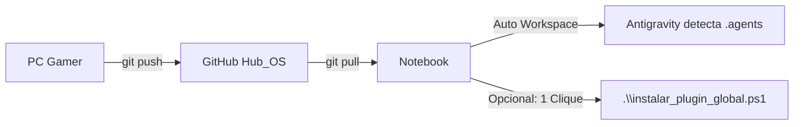

# 🪵 DEVLOG — Diário de Engenharia Hub OS

Registro cronológico e transparente de decisões arquiteturais, evoluções técnicas e marcos do ecossistema **Hub OS — Encontro d'Água Hub**, liderado por **Lídi Moura**.

---

## 📅 [2026-08-23] — Empacotamento do Plugin Nativo Hub OS & Portabilidade Multi-Ambiente

### 🎯 Contexto e Motivação
O Hub OS foi concebido como um ecossistema modular ("plugin agnóstico") capaz de operar tanto em CRMs (Kommo / Provadágua) quanto em ambientes de desenvolvimento avançado (Antigravity IDE / Antigravity CLI / Manus / Claude). Para permitir a orquestração ágil das **15 Skills Mestras** e a aplicação automática das diretrizes de governança em qualquer computador da CEO Digital (PC Gamer de mesa e Notebook móvel), foi implementada a arquitetura de plugin nativo com portabilidade Git zero-lockin.

---

### 📦 O que foi Implementado

#### 1. Manifesto e Estrutura Oficial do Plugin Antigravity
* Criação de `plugin.json` com metadados do Hub OS, autoria de Lídi Moura e palavras-chave de identificação.
* Organização estrutural em conformidade com o subsistema de customizações do Antigravity (`agy-customizations`).

#### 2. Conversão e Padronização das 15 Skills Mestras (`SKILL.md`)
Cada uma das 15 skills originais em JSON foi expandida para o padrão de especificação técnica com YAML frontmatter e procedimentos acionáveis:
1. `hub-os-nexus`: Orquestrador & Guardião do Foco (Córtex Pré-Frontal externo).
2. `hub-os-arquiteto-requisitos`: Conversão de briefings em BRDs técnicos universais em 6 etapas mandatórias.
3. `hub-os-arquiteto-prompts`: Engenharia de prompts blindados e personas da Equipe 10K (Amazô, Yara, Precy, Jury).
4. `hub-os-arquiteto-web-uiux`: PRDs de UI/UX, mobile-first, design TDAH-Friendly e assinatura visual Roxo Açaí + Glassmorphism.
5. `hub-os-desenvolvedor-fullstack`: Padrões de código limpo em React, Vite, Tailwind CSS, Python (Data Science) e Supabase SQL.
6. `hub-os-analisador-leads`: Metodologia Prova d'Água e geração do Kit de Ataque comercial.
7. `hub-os-esquadrao-qualidade`: Auditoria estrita de código, políticas RLS no Supabase, conformidade LGPD e higienização de logs.
8. `hub-os-pesquisador-pd`: Exploração tecnológica e relatórios técnicos em 7 seções mandatórias.
9. `hub-os-documentador-onboarding`: Gestão de conhecimento, DEVLOGs e manuais didáticos.
10. `hub-os-crm-vendas`: Funil de vendas, nutrição e automações no Provadágua CRM e Kommo.
11. `hub-os-tech-influencer`: Building in Public e storytelling técnico conectando inovação à jornada "Reflorestar o Digital".
12. `hub-os-conhecimento-drive`: Recuperação e síntese segura de arquivos no Google Drive e Docs.
13. `hub-os-prompt-lab`: Empacotamento de prompts modulares para SaaS e clientes da agência.
14. `hub-os-onboarding-express`: Acelerador de propostas e briefings rápidos do Link d'Água.
15. `hub-os-engenharia-repo`: Governança de repositórios, CI/CD e saúde da infraestrutura.

#### 3. Regras de Governança Integradas
* `governanca_hub_os.md`: Papel da CEO Lídi Moura, missão e fluxo de delegação assíncrona.
* `seguranca_rbac_lgpd.md`: Zero Hardcoding (.env), isolamento multi-tenant Supabase com RLS e aprovação humana mandatória.
* `padroes_design_codigo.md`: Paleta Roxo Açaí, Glassmorphism e acessibilidade TDAH-Friendly.

---

### 💻 Guia de Portabilidade: Sincronização entre PC Gamer e Notebook

Para alternar entre diferentes máquinas de trabalho sem nenhum retrabalho de configuração:



#### No Notebook (Primeiro Uso):
1. **Puxar as atualizações pelo Git:**
   ```bash
   git pull origin main
   ```
   * *Resultado imediato:* O Antigravity já carregará o Hub OS e todas as 15 skills automaticamente dentro da pasta `Hub_OS` graças ao arquivo `.agents/plugins.json`.

2. **Ativação Global (para usar o Hub OS em qualquer outro projeto no notebook):**
   * Abra o PowerShell na raiz deste repositório e execute:
     ```powershell
     .\instalar_plugin_global.ps1
     ```
   * *Resultado:* O plugin será copiado para `~/.gemini/config/plugins/hub-os` no notebook em menos de 1 segundo.

---

### 🛡️ Conformidade e Segurança
* Nenhum segredo ou chave privada foi incluído nos manifestos ou documentações.
* Compatibilidade 100% preservada com futuras atualizações do Antigravity.
